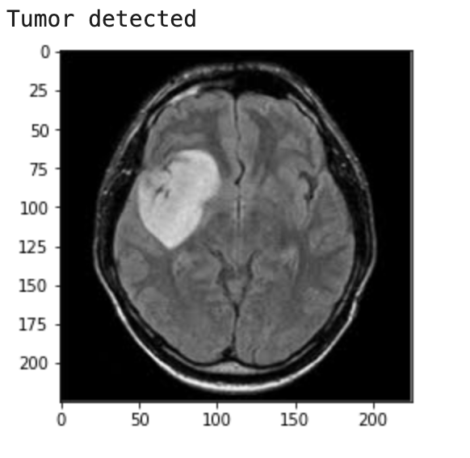

### ⚠️ Disclaimer
MRI scans and patient data are sensitive. Ensure proper anonymization and adhere to ethical guidelines when working with medical datasets.
# Brain Tumor Detection 🧠
**Duration**: Dec 2020 to May 2021

This project employs a Convolutional Neural Network (CNN) to detect brain tumors from MRI scans. Using Python libraries like TensorFlow, Keras, and OpenCV, the model identifies whether an MRI scan contains a brain tumor with high accuracy. 


## 📂 Project Structure

```plaintext
Brain-Tumor-Detection/
├── brain_tumor_detection.ipynb  
├── README.md
└── requirements.txt                
```

## 🔍 How It Works

1.  **Data Preprocessing**:
    
    *   MRI scan images are resized, normalized, and converted to grayscale to prepare them for model training.
        
    *   Labels are assigned based on the presence or absence of a tumor.
        
2.  **Model Architecture**:
    
    *   A Convolutional Neural Network (CNN) is designed using Keras with TensorFlow as the backend.
        
    *   The network consists of convolutional layers for feature extraction and fully connected layers for classification.
        
3.  **Training**:
    
    *   The model is trained on the labeled dataset using supervised learning.
        
    *   Cross-entropy loss is minimized using the Adam optimizer.
        
4.  **Detection**:
    
    *   The trained model predicts whether an MRI scan contains a tumor.
        
    *   The results are evaluated using metrics such as accuracy, precision, and recall.
        

## 🧠 Concepts Explained

*   **Supervised Learning**:The project uses labeled MRI data to train the CNN. Each image is paired with a label indicating whether it contains a tumor.
    
*   **Convolutional Neural Networks**:CNNs are ideal for image classification tasks. They extract spatial hierarchies of features through layers of convolutions, pooling, and activation functions.
    
*   **Metrics**:
    
    *   **Training Accuracy**: 99%
        
    *   **Validation Accuracy**: Between 89% and 92%
        
    *   Evaluated using a confusion matrix and loss plots.
        

## 🔧 Setup and Usage


1. Clone the repository
 ```bash
    git clone https://github.com/ashish-shiju/brain-tumor-detection
    cd brain-tumor-detection
```
    
2. Install dependencies
 ```bash
    pip install -r requirements.txt
 ```   
3.  Run the Jupyter Notebook:
    
    Open brain\_tumor\_detection.ipynb in Jupyter Notebook or Google Colab.
        
4.  Prepare data:
    
    *   Place MRI scan images in the data directory.
        
    *   Update file paths in the notebook if necessary.
        
5.  Train or use the pretrained model:
    
    *   To train from scratch, follow instructions in the notebook.
        
    *   To use the pretrained model, load trained\_model.h5.
        

## 🎯 Results and Visualizations

*   **Training Loss and Accuracy**:Loss and accuracy plots over epochs are generated to visualize model performance.
    
*   **Prediction Example**:Sample predictions are displayed in the notebook, including tumor detection results on test images.
    

## 📚 Technologies Used
### Programming Languages

*   **Python**: Primary language for implementing machine learning models and data analysis.

### Libraries and Frameworks
* **TensorFlow & Keras**: Built and trained the Convolutional Neural Network.
* **OpenCV**: Preprocessed MRI images for resizing and grayscale conversion.
* **NumPy**: Handled numerical operations like array transformations.
* **Pandas**: Managed and manipulated dataframes for easier data handling.
* **Matplotlib**: Visualized training metrics (loss and accuracy plots).
* **Scikit-learn**: Evaluated model performance using metrics like confusion matrix and classification report.


## 📬 Contact

Feel free to reach out if you have questions or suggestions:

*   **Email**: ashish.shiju@outlook.com
    
*   **GitHub**: [ashish-shiju](https://github.com/ashish-shiju)